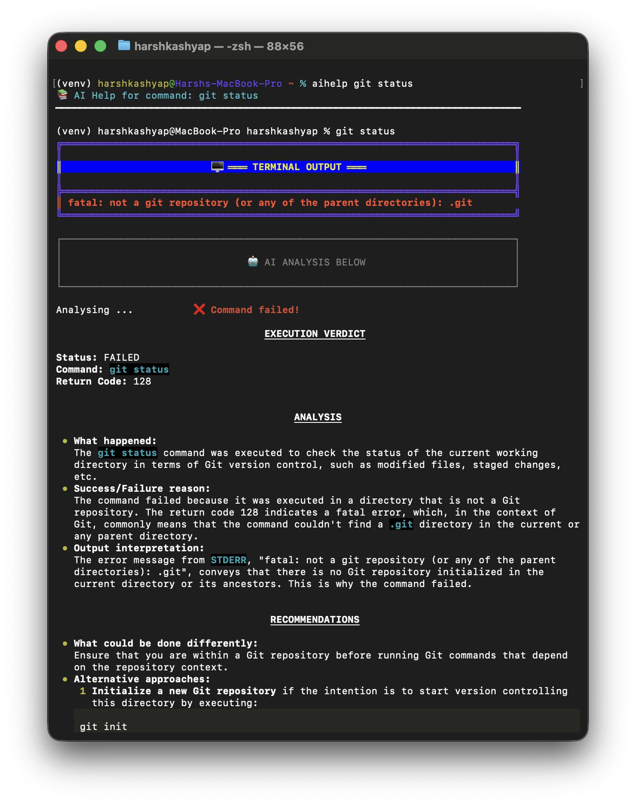
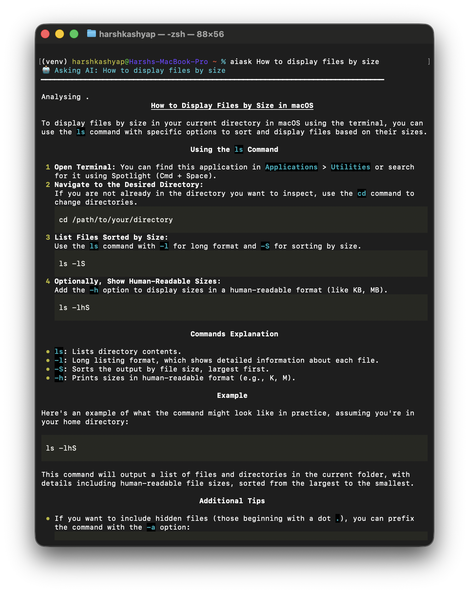

<p align="center">
  
</p>

## Customised ZSHRC + AI Terminal Assistant (macOS)

### TL;DR
- Drop this repo’s `zshrc` into `~/zshrc` and the AI helper into `~/ai_helper.py`.
- Set API keys: `export OPENAI_API_KEY="<your-openai-key>"` and (optional) `export GEMINI_API_KEY="<your-gemini-key>"`.
- Reload shell: `source ~/zshrc` (or run `reload`).
- Use AI in terminal:
  - `aiask <question>` – Ask anything.
  - `aidebug <error text>` – Paste an error to diagnose.
  - `aihelp <command>` – Execute a command and get AI analysis + verdict.
  - `aistatus` – Verify installation.

---

### What this repository provides
- A colorful, productivity-focused `zsh` configuration tailored for macOS.
- Auto-check and optional auto-install of enhanced CLI tools (Homebrew packages).
- A rich alias/function suite for navigation, files, Git, search, processes, network, and system info.
- A comprehensive, category-driven help system (`help`, `help nav`, `help git`, …).
- An AI Terminal Assistant integrated into your shell using OpenAI and Google Gemini for:
  - Asking questions (`aiask`)
  - Debugging errors (`aidebug`)
  - Analyzing executed commands with a success/failure verdict (`aihelp`)


### Requirements
- macOS with `zsh` (default on modern macOS)
- Homebrew (for optional auto-install of tools): `https://brew.sh`
- Python 3.9+ with `pip3`
- Python packages: `google-genai` and `rich` (and optionally `openai`)

```bash
brew install python
pip3 install google-genai rich openai
```


### Setup
1) Place files
- Copy repo `zshrc` to `~/zshrc` (backup your current one first).
- Copy repo `ai_helper.py` to `~/ai_helper.py` and ensure it’s executable:

```bash
cp ./zshrc ~/zshrc
cp ./ai_helper.py ~/ai_helper.py
chmod +x ~/ai_helper.py
```

2) Configure API keys
- OpenAI (required for OpenAI fallback and features):

```bash
echo 'export OPENAI_API_KEY="sk-..."' >> ~/zshrc
```

- Gemini (optional but recommended):
  - The script uses `google-genai`; configure via environment variable you prefer (e.g. `GEMINI_API_KEY` or `GOOGLE_API_KEY`). Update `ai_helper.py` if needed to read your chosen variable.

```bash
echo 'export GEMINI_API_KEY="..."' >> ~/zshrc
```

3) Reload your shell

```bash
source ~/zshrc
# or simply open a new terminal session
```


### AI Assistant Integration (OpenAI + Gemini)
The AI helper script (`~/ai_helper.py`) supports both providers with smart fallback.

- `aiask <question>`
  - Sends a context-aware prompt (OS, shell, cwd) and returns a concise Markdown answer optimized for macOS.

- `aidebug <error text>`
  - Paste an error or issue description to get diagnosis, concrete fix commands, explanation, prevention, and alternatives.

- `aihelp <command>`
  - Executes the command first, shows raw output, then AI provides a structured analysis including a mandatory success/failure verdict derived from the return code.
  - Example:

```bash
aihelp git status
aihelp find . -name "*.log"
aihelp chmod +x script.sh
```

- `aistatus`
  - Verifies that `~/ai_helper.py`, Python, and required modules are available.

- `install_ai_helper`
  - Installs Python dependencies and writes a fresh `~/ai_helper.py` if you need a quick bootstrap.

Notes
- Do not commit API keys. Prefer exporting keys in `~/zshrc` or using macOS Keychain.
- The script prints provider fallback status so you know which model answered.


### Sample Output
Below are examples of the AI-enhanced command analysis and terminal output presentation:






### Auto-install of Enhanced CLI Tools
On interactive shells, `zshrc` checks for handy tools and offers to install missing ones via Homebrew:

- bat, eza, fd, ripgrep (rg), tree, htop, fzf, qrencode

If you agree, it installs them and enables enhanced aliases like pretty `ls` (via `eza`) and syntax-highlighted `cat` (via `bat`). You can later re-run `reload` to source updates.


### Command & Alias Reference (Highlights)
Below is a quick, high-signal tour. Use the built-in help for full details: `help`, `help nav`, `help git`, `help files`, `help search`, `help process`, `help system`, `help network`, `help history`, `help utils`, `help workspace`, or `help all`.

Navigation
- `.. ... .... ~ -` – Quick directory moves
- `d`, `1`, `2`, `3` – Directory stack and jumps
- `workspace`, `ws`, `desktop`, `documents`, `downloads`, `down` – One-tap jumps
- `mkcd <dir>` – Create directory and enter it

Files & Listing
- `ls ll la l lh lt ltr lsize` – Colorful ls variants (eza if available)
- `cat` – Uses `bat` if installed, falls back to `cat`
- `tree` – Color tree view
- Safer ops: `cp`/`mv`/`rm` prompt by default; `mkdir -pv`, `rmdir -v`
- Utilities: `cpcontent` (file → clipboard), `cppath` (pwd → clipboard), `finder`, `preview`, `extract <archive>`, `backup <file>`

Search
- `grep`, `fgrep`, `egrep` – Colorized
- `findfile <name>`, `finddir <name>`, `findin <text>` – Handy wrappers

Git
- Shorthands: `g`, `ga`, `gaa`, `gc`, `gca`, `gco`, `gcb`
- Status/diff/log: `gs`, `gss`, `gd`, `gds`, `gl`, `gll`, `gtree`
- Sync: `gp`, `gpl`, `gf`, `gm`, `gb`
- Resets: `gundo`, `greset`, `gclean`, `gst`, `gstp`

Processes & System
- Views: `processes`, `ptop`, `pscpu`, `psmem`, `top`, `htop`, `myps`
- Kill: `kpid <pid>`, `kname <name>` (interactive), `kport <port>`, `fkill <pid|name>`
- Disk/Env: `df`, `du`, `sizes`, `biggest`, `env`, `path`, `aliases`, `reload`

Network
- `myip`, `localip`, `ping`, `wifi`, `ports`, `speedtest`

History (auto-logged with timestamp + path)
- `viewhistory` / `vh` – Last 100 commands
- `searchhistory` / `sh` – Search; also `-path`, `-time`, `-date` (supports `today`/`yesterday`)
- `historystat` / `hs` – Stats: totals, top commands, most active directories
- `cleanhistory` / `ch` – Keep last 10,000 entries (auto-clean runs periodically)

Built-in Help System
- `help` – Main menu
- `help <category>` – `nav`, `git`, `files`, `search`, `process`, `system`, `network`, `history`, `utils`, `workspace`
- `help all` – One-shot list of everything
- `help <command>` – Quick synopsis + examples

Custom Project Shortcuts
- Env: `activate` – Activate a pre-configured Python venv
- Folders: `dl` (Dennis Labs), `proj` (Projects)
- Remote: `connectdietnerd`, `connectdietnerdstaging` (SSH with provided keys)


### Using the AI effectively
- Prefer precise prompts (include the goal, context, and constraints).
- For failures, paste the exact error into `aidebug`.
- For “what happened?” questions, wrap the real command with `aihelp` to get a deterministic verdict based on the return code.
- Use `aistatus` if something feels off.


### Troubleshooting
- AI keys
  - Ensure `OPENAI_API_KEY` is exported. For Gemini, export `GEMINI_API_KEY` (or adjust `ai_helper.py` to your env var).

- Python modules
  - `pip3 install google-genai rich openai`

- Homebrew
  - If missing, the `zshrc` will offer to install it and required tools. You can also install manually.

- Aliases overriding each other
  - If you enable `eza` aliases early and later see `ls` revert to classic `ls -G`, search `~/zshrc` for multiple `alias ls=...` lines and keep only the variant you prefer.

- Workspace helpers
  - The help system documents workspace commands (e.g., `sss`, `go*`). If they’re not yet defined on your machine, add or adapt them as needed.


### Security
- Do not commit API keys. Use environment variables or a secrets manager.
- Review `~/zshrc` for any hardcoded keys and replace with env vars.


### License
Personal configuration meant to be customized. Adapt freely within your environment.


# AI-Terminal
# AI-Terminal
